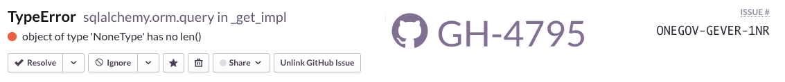

Sentry Large GitHub Issue
=========================

This is a Chrome extension with a user stylesheet to make the GitHub issue
link in Sentry *very large* and hard to miss.

The motivation behind this is that by default it's very inconspicuous, and if
overlooked, might lead to people investing redundant time into analyzing an
issue that has already been looked at.



> **Note**: This extension is basically a quick & dirty hack, and should be considered experimental. Tested with Sentry 8.22.0.


Installation
------------

1. Clone the extension into the directory where it will live

  ```
  cd ~/src
  git clone https://github.com/lukasgraf/SentryLargeGithubIssue.git
  ```

2. Visit [chrome://extensions](chrome://extensions)
3. Enable developer mode

   

4. Select "Load unpacked" to load the extension, selecting the directory you cloned it to.

   


 Configuration
 -------------

 The extension offers no configuration options *per-se*. Its URL matching pattern is `"*://*/sentry/*"`.

 If required, you can change this in `manifest.json` after cloning the repo.
